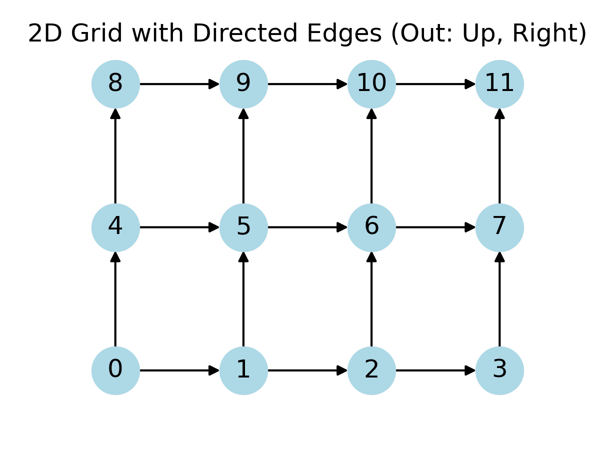
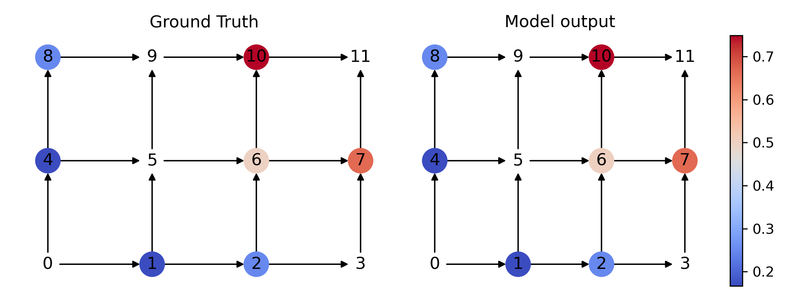

# CSP_Graph

## Goal
This is the python code of "Graph Based Database Generation from Query Constraints".

The goal is to leverage graph method (GCN) to learn the Cumulative Density Function (CDF) of synthetic database generation problem. The query workloads are considered as Constraint Satisfaction Problems (CSPs).

## Datasets

- census-2
- census-3
- wine-2
- wine-3

## Basic Usage

### Our model - GCN
```python
python train.py --dataset wine-3 --query-size 10000 --channels 2,16,1 --num_layers 3 --epochs 3000 --bs 1000 --lr 1e-2 --opt adam --loss MSE
```

### Baseline - PGM
```python
python PGM.py --dataset wine-3 --query-size 10
```

### Baseline - SMT
```python
python SMT_z3.py --dataset wine-3 --query-size 10
```

## File Structure

- Key components:

  - dataset.py : Process the datasets.
  - utils.py : Utilitiy functions.
  - preprocessing.py : Build the graph
  - models.py : Build the model
- demo.py : simple 2D demo for proposal.


<!-- ## Fomulation

Consider a 2D version: For a bivariate distribution, represented by x, y, we have the following constraints:

### Constraints

- P( X <= 1) = 1/4
- P( Y <= 2) = 2/3
- P( X <= 2, Y <= 2) = 1/3
- ...

### Models

- 2D-Grid with each node present  P( X <= i, Y <= j)

- Directed graph with outedge to upper and right node (Monotonicity).

- Supervised learning, each node has a value represent its probability.

  

### Output

- To the labeled (with color) node, the model output is similar to its ground truth.



### Evaluate

- Give perfect prediction to further distribution constraints, like:
- P( X <= 1, Y <= 3) = ?
- P( X <= 4) = ? -->


## Require environment

- Python
- PyTorch
- torch_geometric
- Networkx

