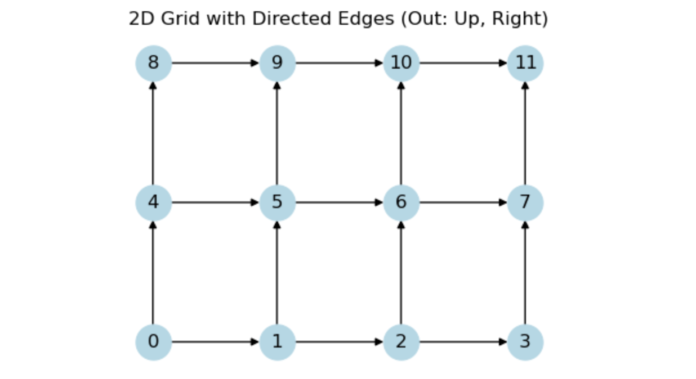
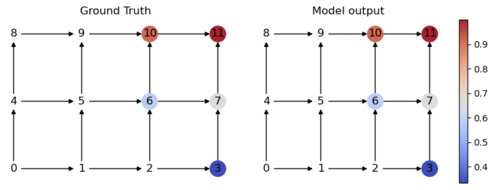

# CSP_Graph

## Goal

We use graph method (GCN, etc.) to solve Constraint Satisfaction Problems (CSPs), start with 2D, 3D, and expand it toward up to 10 dimensions if possible.

## Fomulation

Consider a 2D version: For a bivariate distribution, represented by x, y, we have the following constraints:

### Constraints

- P( X <= 1) = 1/4
- P( Y <= 2) = 2/3
- P( X <= 2, Y <= 2) = 1/3
- ...

### Models

- 2D-Grid with each node present  P( X <= i, Y <= j) 

- Directed graph with outedge to upper and right node (Monotonicity).

- Supervised learning, each node has a value represent its probability.

  

### Output

- To the labeled (with color) node, the model output is similar to its ground truth.

### Evaluate

- Give perfect prediction to further distribution constraints, like:
- P( X <= 1, Y <= 3) = ?
- P( X <= 4) = ?

## Language and possible package

- Python
- TensorFlow GNN
- Spektral
- PyTorch
- torch_geometric
- Networkx

## Teamwork

- Git