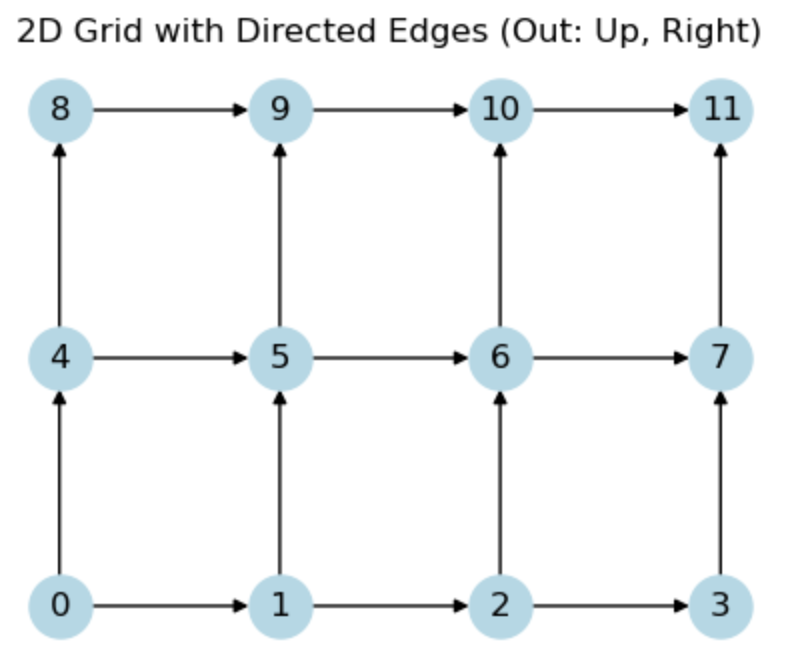

# CSP_Graph

## Goal

We use graph method (GCN, etc) to solve Constraint satisfaction problems (CSPs), start with 2D, 3D, and expand it toward up to 10 dimensions if possible.

## Fomulation

### Constraints

- P( X <= 1) = 1/12
- P( Y <= 2) = 2/3
- P( X <= 2, Y <= 2) = 1/3
- ...

### Models

- 2D-Grid with each node present  P( X <= i, Y <= j) 

- Directed graph with out edge to upper and right node (Monotonicity).

- Supervised learning, each node has a value represent its probability.

  

### Output

- To the labeled node, the model output is similar to its ground truth.

## Language and possible package

- Python
- PyTorch
- torch_geometric
- Networkx
- TensorFlow

## Teamwork

- Git